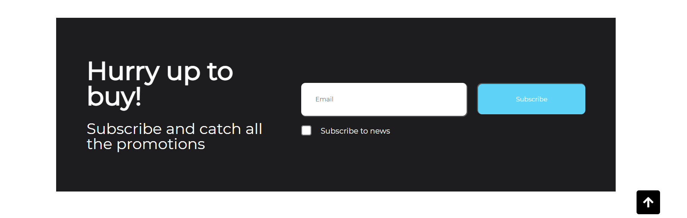

   

 
   
   
   
   <h1 align="center">This is my first project.</h1>
   
I hope you like cats, becouse it's <strong>Cat Shop.</strong>

---
   <h2 style="text-decoration: underline">For the visitor</h2>

   >___Attention___ :
   - If you want to run the project you need to open it <strong>localhost</strong>, unfortunately it does not work <strong>Fetch</strong>.

---

   <h2 align="center">You can see some photo from my WebSite</h2>

   <h3>Desktop version:</h3>

   ---

   <h4><em>-Header</em></h4>

   

   
   

   <h4><em>-Catalog</em></h4>

   

   
   

   <h4><em>-Footer</em></h4>
   
   

   
   

   ---

   <h3>Mobile version:</h3>

   ---

   <h4><em>-Header</em></h4>

   

   
   

   <h4><em>-Burger Menu</em></h4>

   

   
   

---

[Go to Top](#to-top)
